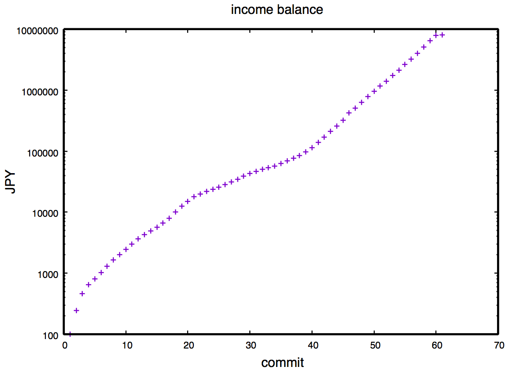

# Subcon test 001

This is a traning example for the Rwanda Ether community to share subcon works.

# Mathmatical Model

## Incentive model

 * 1st commit: you will get 100 MAK
 * 2nd commit: you will get X(2) MAK
 * n-th commit: you will get X(n) MAK
 * recurrence relation: X(n) = X(n-1) * (C(n-1) - 0.5)
 * difficulty: 1.0 < C < 2.0
 * C is a difficulty coefficient for n-th commit. If the commit needs very tough work, C becomes close to 2.0. On the other hand, if not so tough work, C is close to 1.0.
 * X(n) is rounded to the nearest even for each commit.

## Example of a simulating result

Initial Budget from a Client = 8000000 JPY (example case)

| n | X(n) | C(n) | commit hash | balance (MAK) | Client's Budget (JPY) |
|---:|---:|---:|:---| ---:|---:|
| 1 | 100 | 1.969 | commit 56e292ed0dac7821b12c9e8ead1c32d189ab47aa | 100 | 7999900|
| 2 | 147 | 1.963 | commit d2c47c28b6d58661615552db195e4e20f85c6f24 | 247 | 7999753|
| 3 | 215 | 1.340 | commit 8fb577b13d33379ae5210059e7237889b1030940 | 462 | 7999538|
| 4 | 181 | 1.359 | commit 403f88f1047f18dbc6dff6dc5e30f96d2e47a16d | 643 | 7999357|
| 5 | 156 | 1.885 | commit 285e70a6348ffffef80b0ef6770e0310ed1db47e | 799 | 7999201|
| 6 | 216 | 1.815 | commit 404d41872bf4122dca45d5d159d47c39d6a71490 | 1015 | 7998985|
| 7 | 284 | 1.769 | commit a7f59116975c02adbe6060a387e7656d4c147942 | 1299 | 7998701|
| 8 | 360 | 1.516 | commit dbf68749cb635e55a5f5b63b4e1a5477752ea886 | 1659 | 7998341|
| 9 | 366 | 1.724 | commit 4eaabc827342ddbc9bd095b53d5ba0b97e3c3a86 | 2025 | 7997975|
| 10 | 448 | 1.725 | commit 432de77aa051ff0a5e0d9b54e08c57d9787b6729 | 2473 | 7997527|
| 11 | 549 | 1.707 | commit 372ca29fba3a52bafc5d651c87fdaa0edd09ee0b | 3022 | 7996978|
| 12 | 663 | 1.411 | commit be1f3408dc8edb7ed4d7e4f0a0bc3c89dc70ecd7 | 3685 | 7996315|
| 13 | 604 | 1.601 | commit e62ee33aa63566c985e8a99c4444af4ff4555e43 | 4289 | 7995711|
| 14 | 665 | 1.575 | commit 0b71b9c08eb5a7c8401cab53f653f1d7d0a0d234 | 4954 | 7995046|
| 15 | 715 | 1.806 | commit 84c7c1a9b56b9e76f50ad4784c31de55bf95152c | 5669 | 7994331|
| 16 | 934 | 1.996 | commit 592a3183fb55e353d96cef12eb2361e51123c85d | 6603 | 7993397|
| 17 | 1398 | 1.965 | commit 512bc0fe91f163eda034828c4b4f5b9d49a5fbd6 | 8001 | 7991999|
| 18 | 2047 | 1.681 | commit 0348254dd0d711cdc41b4ba26b88ba85fe0a8940 | 10048 | 7989952|
| 19 | 2417 | 1.611 | commit 1a63286ada731e13de13f931cfedf44088bfe997 | 12465 | 7987535|
| 20 | 2686 | 1.488 | commit 66f442ca83276384f19fdc0373f673fe1e036983 | 15151 | 7984849|
| 21 | 2653 | 1.325 | commit 221fcee60e0fc24e4a6c62e642fec67b2c6ed01c | 17804 | 7982196|
| 22 | 2189 | 1.319 | commit 3f049a085bc2ec8d7f93fac7a9b16b22884e5a4c | 19993 | 7980007|
| 23 | 1793 | 1.625 | commit 8915165083fd6b9cbe9cba46a722033d9d43f5ee | 21786 | 7978214|
| 24 | 2018 | 1.523 | commit e031d662e79e7a542b4f06135227c7022ef23c05 | 23804 | 7976196|
| 25 | 2064 | 1.566 | commit 541606655905a53de8dfa53ae734504b79a5e02e | 25868 | 7974132|
| 26 | 2200 | 1.924 | commit a5859425031db0f23c022daf1f9f98cb15cb5a56 | 28068 | 7971932|
| 27 | 3133 | 1.668 | commit 100cf714338bcfee09f480002b12001f09cd70cb | 31201 | 7968799|
| 28 | 3659 | 1.692 | commit 622a28bc52f12a96f5e7a7c5ccd30b10070d18ce | 34860 | 7965140|
| 29 | 4363 | 1.465 | commit fb68c947c170cafd8f2cb697505e90186c850c51 | 39223 | 7960777|
| 30 | 4212 | 1.317 | commit 1e2e48c643a5fe52370c4f7a184c12af2014aa33 | 43435 | 7956565|
| 31 | 3440 | 1.528 | commit c383fbf8b40aff48b0a3f33c1979715a6599257e | 46875 | 7953125|
| 32 | 3535 | 1.396 | commit 07b4de8d32f9f67a75bb87c61fc62339e710f719 | 50410 | 7949590|
| 33 | 3166 | 1.657 | commit 6c4315d1488644134e646259b6b7def435dccd4d | 53576 | 7946424|
| 34 | 3664 | 1.999 | commit 562869eb9878ee3671f31e617526a9f7b4fb53ed | 57240 | 7942760|
| 35 | 5493 | 1.772 | commit d47b080809ef72bec7f9d2d4d230c21d8ea4130d | 62733 | 7937267|
| 36 | 6988 | 1.427 | commit 1e51feff404ac4f66bd0c000b9327dd5cbba23de | 69721 | 7930279|
| 37 | 6480 | 1.926 | commit 5bd1930e1f9d337eca4b4b8fab08d4198fa92726 | 76201 | 7923799|
| 38 | 9237 | 1.858 | commit f730d3341f6c0ee77dbd08017b3d81e8f967c46e | 85438 | 7914562|
| 39 | 12541 | 1.814 | commit a8c377afc3cfc167b71d9db589edbb4ce8d2c56b | 97979 | 7902021|
| 40 | 16480 | 1.935 | commit 55b8d74115980bbec4937ec1cadfb225c7a0ffc7 | 114459 | 7885541|
| 41 | 23642 | 1.834 | commit 36a297976c4a9f7d8e0421878f96999b743b2238 | 138101 | 7861899|
| 42 | 31539 | 1.853 | commit 8b2813c919e00cce0bba6493e604c029d232ab2a | 169640 | 7830360|
| 43 | 42667 | 1.548 | commit 0b7144820449a4ad03bcdd61a6d62a074aef1a05 | 212307 | 7787693|
| 44 | 44700 | 1.987 | commit d23e2e26dbdb2a98c0186d2897c72249fc26a260 | 257007 | 7742993|
| 45 | 66455 | 1.973 | commit 85e800b80318251b67d2389a9f09c20b92149948 | 323462 | 7676538|
| 46 | 97910 | 1.413 | commit 9a4dcbdd46b77201d27bc799af44a0ea13edfe54 | 421372 | 7578628|
| 47 | 89375 | 1.828 | commit f53922715ca8a62a112005cac7f8c043aea06be1 | 510747 | 7489253|
| 48 | 118672 | 1.801 | commit 6a887d1f32c64ad8190f334d87c2813616a5ab6a | 629419 | 7370581|
| 49 | 154345 | 1.623 | commit c6d79a841d7ba70158afa6bc78ed96739de69fa0 | 783764 | 7216236|
| 50 | 173327 | 1.671 | commit 18ce50e9195b90028613d700d4dd3ef8d341fb55 | 957091 | 7042909|
| 51 | 203009 | 1.643 | commit 015127d9424ee38398e23df2bb0030c3b0e79250 | 1160100 | 6839900|
| 52 | 232041 | 1.947 | commit 9971a2072cf38559933c5a42b08fd9a37b63162c | 1392141 | 6607859|
| 53 | 335852 | 1.651 | commit 70227335a660c85ac39867bb219389e036f4e31c | 1727993 | 6272007|
| 54 | 386428 | 1.882 | commit bc5a91bd9aa0c04dc07fcbebc5e2b2f1e3522ad8 | 2114421 | 5885579|
| 55 | 534069 | 1.548 | commit cbfb2cb3ac2f656096e872a17a4abdd40e56fed7 | 2648490 | 5351510|
| 56 | 559569 | 1.918 | commit 1e98ffc7dcf99719855efff9c5c3667bc98f658f | 3208059 | 4791941|
| 57 | 793466 | 1.930 | commit 8e07d3c4278aa62c4e7596a9e548ea07d5461056 | 4001525 | 3998475|
| 58 | 1134490 | 1.623 | commit f14586f18c7d49fa7fad0de9377aff11ca5cb16e | 5136015 | 2863985|
| 59 | 1273702 | 1.697 | commit 8a0d4c339748a23e919333245ca158c4e45f6e2f | 6409717 | 1590283|
| 60 | 1525123 | 1.944 | commit d173177fa60ed9d87a47765c992a565bbf1aea6f | 7934840 | 65160|
| 61 | 65160 | 1.807 | commit c681001505cb0b0870203c04ccac5492f455bc30 | 8000000 | 0|

### plots

## Negative Incentive model

 * Annoyance: banned for 3 months, freeze the project (no commits for 3 months)
 * Cheating: banned forever, freeze the commits (no commits forever)

# Q & A

If you have any question, please add below. It will be also counted as 1 commit. 

 * Q1:
 * Q2:

